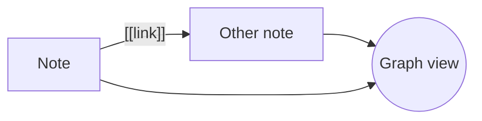

# Welcome to kbmd

Your notes are plain Markdown files in a folder on your disk. Nothing is locked in. #help

## Linking

- Type `[[` to link to another note: [[Ideas]] (click it, the note is created on first use).
- `[[Note#Heading]]` jumps to a heading, `[[Note|shown text]]` changes the label.
- Tags look like #getting-started. Click one to find every note that has it.
- The right sidebar lists **backlinks**; the graph button shows how everything connects.

## Files and images

Drop, paste or upload files into the editor. They are stored in `attachments/` and embedded with
`![[picture.png]]` (add `|300` to set a width).

A gallery takes image names or a whole folder, one per line:

````
```gallery
attachments/
```
````

## Diagrams

Mermaid diagrams are written as text:



Free-form drawings are made with the built-in sketch editor: use **New drawing** in the sidebar,
then embed it with `![[My drawing.excalidraw]]`.

## Flashcards

Any note tagged `#flashcards` is a deck named after the note; `#flashcards/spanish` names the deck
yourself. Inside such a note, cards look like this:

````
#flashcards/spanish

hola::hello
gato:::cat

How do you ask for the bill?
?
La cuenta, por favor.

The capital of Spain is ==Madrid==.
````

- `Question::Answer` is one card; `:::` also asks it the other way round. One card per line, list items work too.
- A line with just `?` splits a longer card into question (above) and answer (below); the card ends at the
  next blank line. `??` adds the reverse card.
- `==highlight==` hides that part of the paragraph (a cloze); each highlight is its own card.
- Images, links and formatting work inside cards. Text in `inline code` or fenced code blocks never becomes a card.

Review with spaced repetition from the graduation-cap button in the left ribbon (`Space` shows the answer,
`1`-`4` rate it), or export a deck for Anki from the same place.

## Tasks and boards

Any `- [ ]` item anywhere in the vault shows up in **Tasks** (the checklist button in the ribbon). Add a due
date with `📅 2026-09-20` or `due:2026-09-20`, tags with `#tag`; ticking a task there edits the note.

A note tagged `#kanban` is a board: every `## heading` is a column, every list item under it a card. Open it
from the **Kanban** button, drag cards between columns (or use a card's `⋯` menu on a phone). A card dropped
into a column called *Done* is checked off.

## Calendar

Events are list items in a note tagged `#calendar`, each starting with a date or a rule:

````
#calendar

- 2026-09-25 14:30 Dentist
- 2026-10-03..2026-10-05 Trip
- every Mon,Wed 07:00 Gym
- every 2 weeks Tue Team sync from 2026-09-15
- every month 1 Rent
- every year 03-14 Pi day
- birthday 1990-03-14 Mom
- birthday 15 May Mary
````

`every day`, `every weekdays`, `every month last`, a time range like `14:30-15:00`, and `until 2026-12-31` work too.
A birthday without the year (no age shown) takes `05-15`, `15.05`, `15 May`, `May 15`, `May, 15` or `15.May`.
The **Calendar** tab shows them with daily notes and due tasks, adds events for you, and exports an `.ics` file.

## Habits

List the habits you want to keep in any note tagged `#habits`, one per list item:

````
#habits

- Exercise
- Read 20 pages (3x/week)
- Meditate
````

`(3x/week)` sets a weekly target; a habit without one is daily. Open **Habits** (the repeat button in the
ribbon) to check days off, see streaks and this week's count. Check-ins are kept in `.habits.json` in the vault,
so they sync with your notes.

## Everything else

- [ ] Try the quick switcher: `Ctrl+O`
- [ ] Search everything: `Ctrl+Shift+F` (supports `"exact phrases"`, `tag:help`, `path:folder`)
- [ ] Set up sync with GitHub or GitLab in the sync dialog (bottom left)
- [ ] Export the whole vault as a zip from the same corner

| Shortcut | Action |
| --- | --- |
| `Ctrl+S` | Save now (notes also save automatically) |
| `Ctrl+E` | Cycle editor / split / preview |
| `Ctrl+O` | Quick switcher |
| `Ctrl+Shift+F` | Search |
